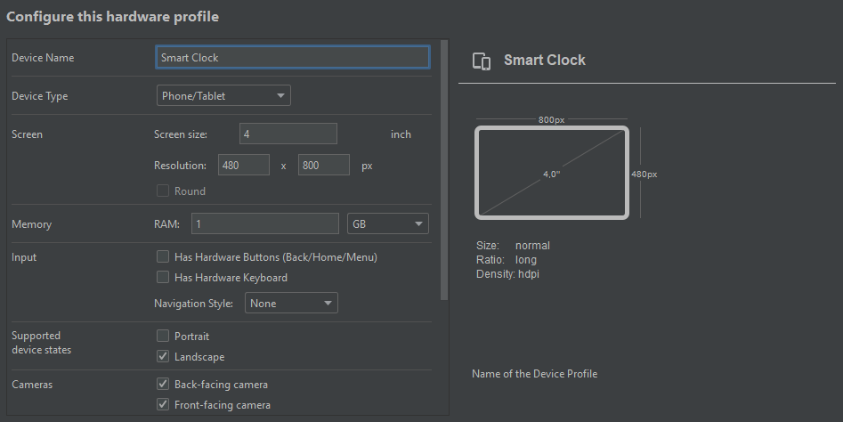

## "Emulador Smart Clock"

Veja um desses requisitos, descrito em [Submission Requirements](https://flutter.dev/clock). :
> The clock design should use landscape mode, with a 5:3 aspect ratio.

Provavelmente ao executar um dos exemplos no seu celular a aparência do relógio deve ter ficado estranha. Acredito que seja o aspect ratio de 5:3 conforme mencionado no requisito. Para resolver esse problema fiz uma pesquisa, *inclusive sobre o [dispositivo real](https://www.lenovo.com/gb/en/smart-clock/)*, para criar um emulador nos moldes desse requisito.

Basicamente ao criar uma nova AVD simples teremos:

| Propriedades  | Valor |
| ------------- | ------------- |
| Screen Size  | 4  |
| Resolution  | 480 x 800  |  
| RAM  | min 1GB  |  
| Supportes device states  | landscape  |  

Ao criar uma AVD pelo Android Studio ficou assim:

